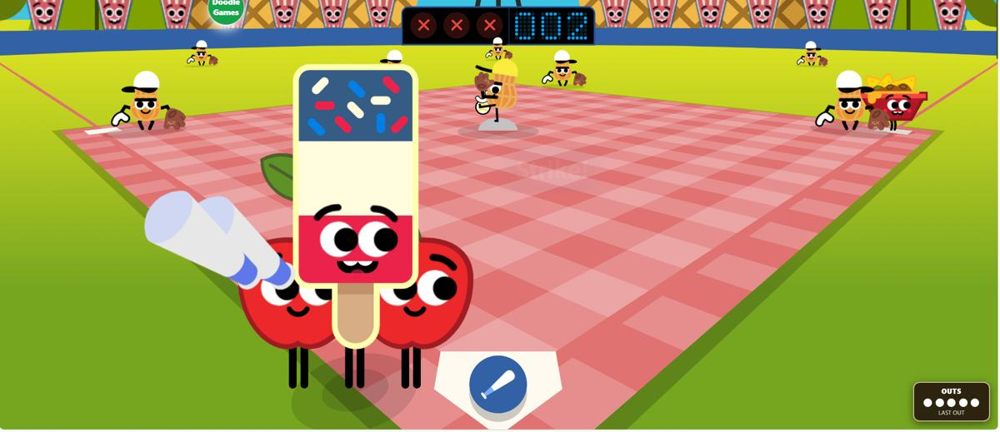

# Doodle Baseball Expanded

**I wanted more pitches. It got a little out of hand.**

Doodle Baseball Expanded is an unofficial fan-made expansion for the 2019 Doodle Baseball game. It keeps the original game underneath and builds a much larger challenge/progression layer around it.

[**Download the latest release**](https://github.com/adamelfadl2019-boop/doodle-baseball-expanded/releases/latest) · [Project website](https://adamelfadl2019-boop.github.io/doodle-baseball-expanded/) · [Pitch Encyclopedia](https://adamelfadl2019-boop.github.io/doodle-baseball-expanded/pitches.html) · [Report a bug](https://github.com/adamelfadl2019-boop/doodle-baseball-expanded/issues/new/choose)



## What is actually in it?

- **3,000 named pitches** — real baseball pitches first, then increasingly unreasonable ones.
- **16 movement variants** — variants change timing, speed, break, or behavior instead of just changing the name.
- **48,000 Gauntlet combinations** — every base pitch can appear with every variant.
- **50 signature pitches** — including Magic Zoomball, Black Hole, Gravity Flip, Teleport Curve, Time Freeze, Glitchball, Vortex Cannon, and more.
- **Perfectionism** — build a D → S+ precision streak with 98%+ contact.
- **Boss Ladder** — beat the 50 signature pitches in order by homering each one.
- **Real defense additions** — peanut pickups, fly catches, throws to first, runner races, foul territory, wall rebounds, and SAFE/OUT calls.
- **Progression** — mastery medals, achievements, missions, character traits, and multiple arcade modes.
- **F9 debugging** — live pitch/mode/fielding state plus issue-report and JSON diagnostics.

## Why I made it

Honestly, this started because I wanted more pitches.

The original game is tiny, simple, and really fun, and I kept wondering what it would feel like with actual progression and increasingly ridiculous pitches. That slowly turned into a much bigger project.

V19 is the first version I consider a proper public release. From here, updates should be driven by real playtesting, bugs, balance, and ideas that actually make the game better — not by making the feature count bigger just for the number.

## Install

### Windows

1. Download the latest installer ZIP from [Releases](https://github.com/adamelfadl2019-boop/doodle-baseball-expanded/releases/latest).
2. Extract the ZIP somewhere normal. **Do not run it from inside the ZIP.**
3. Run `START_REAL_MOD.bat`.
4. If needed, point the launcher at a compatible copy of the original Doodle Baseball files.
5. The launcher creates separate modded launch files, starts a local server, and opens the game.

You can also run:

```bash
python launcher.py
```

Useful troubleshooting commands:

```bash
python launcher.py --diagnose
python launcher.py --repo "C:/path/to/doodlecricket.github.io-master"
python launcher.py --no-browser
python launcher.py --port 8000
```

**The original `game.js` is not overwritten.**

If installation fails, see [DEBUGGING.md](DEBUGGING.md).

## Ways to play

| Mode | What it does |
| --- | --- |
| **Expanded** | The main modded game with the full pitch system. |
| **Perfectionism** | Chase near-perfect contact and keep your grade/streak alive. |
| **Boss Ladder** | Beat the 50 signature pitches one at a time. |
| **Legendary Rush** | Signature pitches only. |
| **Mystery Box** | The pitch identity stays hidden until the play resolves. |
| **Arcade Frenzy** | Faster, stranger, less reasonable baseball. |
| **Pitch Lab** | Practice and inspect specific pitches. |
| **Gauntlet** | Work through base-pitch + variant challenges. |

## The pitch system

The original engine still receives its normal vanilla pitch IDs. DBE keeps its custom identity/movement system separate so a weird custom pitch does not break the original hit logic.

That separation became one of the most important stability rules in the project.

The full catalog is browsable here:

**[Open the 3,000-pitch encyclopedia](https://adamelfadl2019-boop.github.io/doodle-baseball-expanded/pitches.html)**

## Debugging

Press **F9** in-game.

The debug tools can show things such as:

```text
Mode: Expanded
Pitch: #023 Black Hole
Variant: Corkscrew
Game: READY
Fielders: 7
Defense: ON
Fouls: ON
Wall: ON
```

For a bug report, include the F9-generated report or `DBE_LAST_ERROR.txt` when possible.

See [DEBUGGING.md](DEBUGGING.md) or [open an issue](https://github.com/adamelfadl2019-boop/doodle-baseball-expanded/issues/new/choose).

## Project status

**Current public release: V19 / v19.0.0**

The huge feature-building phase is over. The priorities now are:

1. real playtest bugs,
2. installer/compatibility problems,
3. balance and animation polish,
4. better handcrafted content,
5. larger updates only when they are worth doing.

See [ROADMAP.md](ROADMAP.md) and [CHANGELOG.md](CHANGELOG.md).

## Repository layout

```text
launcher.py                  launcher / patcher / local server
payload/dbe-mod.js           main DBE runtime
data/pitches.json            3,000 pitch identities
data/variants.json           16 pitch variants
docs/                        GitHub Pages site + pitch browser
media/                       README/project images
.github/                     issue forms + CI
tools/validate_release.py    repository/release validator
```

## Contributing

Small, focused fixes are welcome. Please read [CONTRIBUTING.md](CONTRIBUTING.md) first.

The main rule: **do not add filler just to make the mod sound bigger.** A new pitch, mode, or system should have an actual reason to exist.

## Legal

Doodle Baseball Expanded is an unofficial fan project and is not affiliated with or endorsed by Google.

This repository intentionally does **not** include the original game's artwork/assets/source files. The MIT license applies to original DBE code and documentation in this repository. Third-party artwork, trademarks, and source remain with their respective owners.

See [THIRD_PARTY_NOTICE.md](THIRD_PARTY_NOTICE.md).
